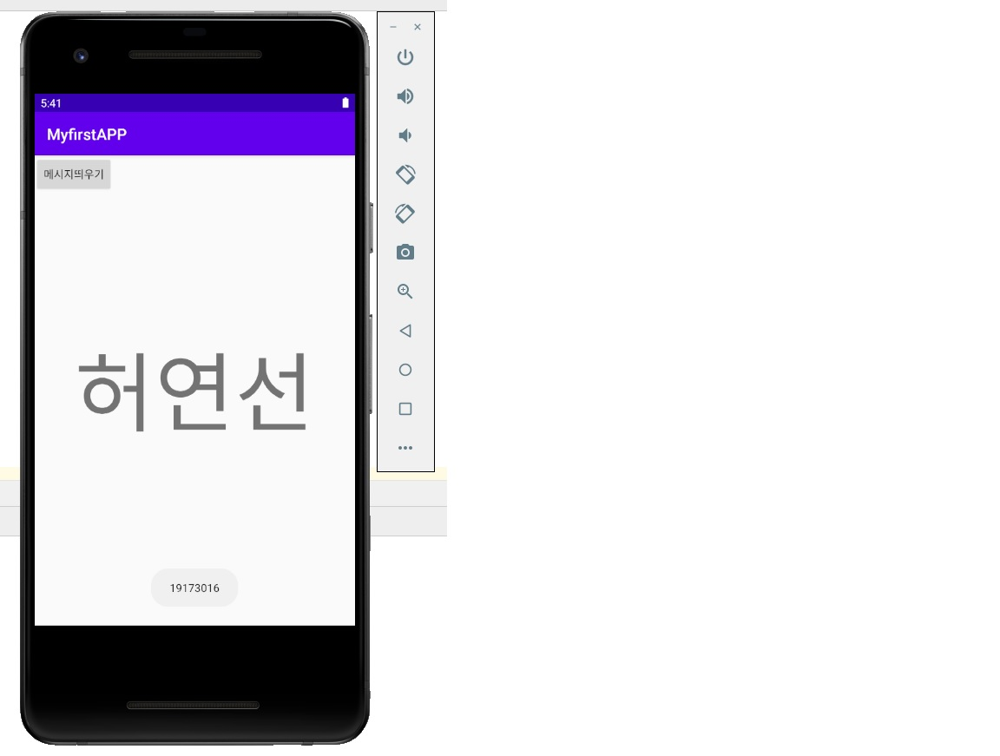
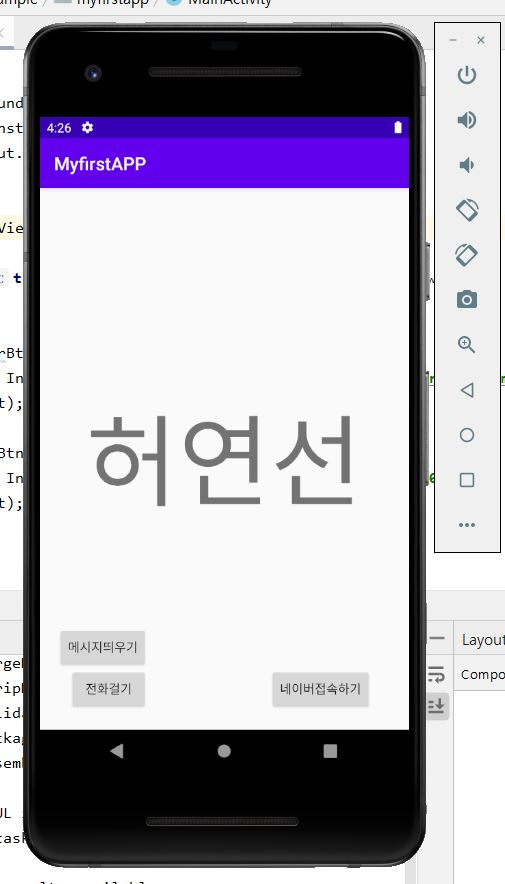
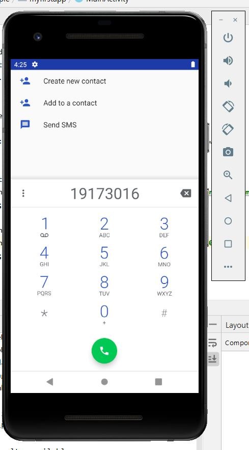
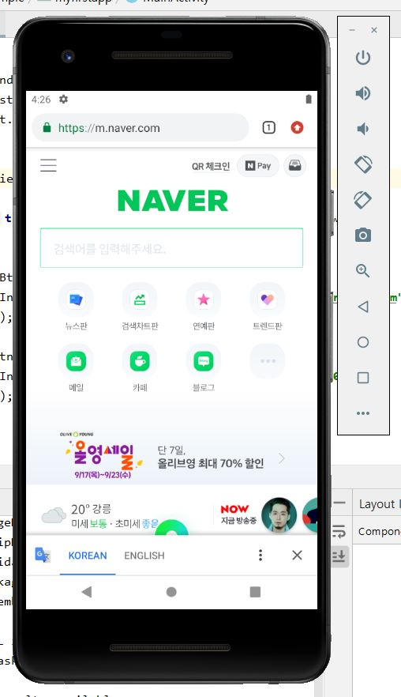

# 19173016 허연선 

## 1주차 과제 

 </img>
 
## 2주차 과제 

 </img>

## 3주차 과제

 </img>
 </img>
 </img>

## 4주차과제

# 카페 테이블 공석 수 
매장에 있는 의자나 테이블에 센서를 달아서 매장에 자리가 있는지 없는지, 있으면 몇자리가 있는지 알 수 있는 앱을 개발하는 것입니다.
매장에서 먹으려 카페에 갔는데 자리가 없을 때 허무함과 앉아서 먹고싶어도 못먹고 돌아가는것을 좋아하는 사람은 없을 것입니다. 
그래서 매장에 오기전에 매장 안 테이블이 몇 개 남았는지 알수있도록 공유하는 서비스입니다.
그래서 기존에 있던 카페앱에서 기능을 추가하거나 새로운 앱을 개발하는 것도 좋을것같습니다. 
